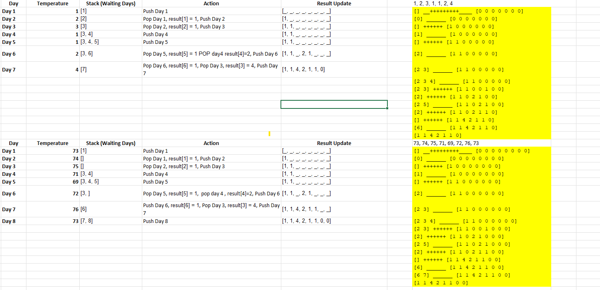

You and your friends are waiting in line to get ice cream, but the shop has a rule: 👉 You must wait until someone ahead of you gets a bigger ice cream before you can leave the line!

Each person in the line is waiting for a warmer day (higher temperature) before they can leave.

Step-by-Step with a Stack 📚
We will build a stack (like a pile of books) to track who is still waiting for a bigger ice cream.

Example: Ice Cream Sizes for 7 Friends
Each number represents the size of ice cream available on different days:

go
[1, 2, 3, 1, 1, 2, 4]
🔹 Goal: Find out how many days each person has to wait for a bigger ice cream.

Now, Let's Play the Game! 🎲
We go through each person one by one:

1️⃣ Day 1: Ice Cream Size = 1 🍦
Nobody is ahead to compare yet.

Put Day 1 on the stack! 🏗

Stack: [1]

2️⃣ Day 2: Ice Cream Size = 2 🍧
It’s bigger than Day 1’s ice cream!

Pop Day 1 from the stack.

Day 1 has to wait 1 day for a bigger ice cream.

Put Day 2 on the stack.

Stack: [2] Result: [1, _, _, _, _, _, _]

3️⃣ Day 3: Ice Cream Size = 3 🍨
Bigger than Day 2’s ice cream!

Pop Day 2.

Day 2 has to wait 1 day.

Put Day 3 on the stack.

Stack: [3] Result: [1, 1, _, _, _, _, _]

4️⃣ Day 4: Ice Cream Size = 1 🍦
Smaller than Day 3. Just wait!

Put Day 4 on the stack.

Stack: [3, 4] Result: [1, 1, _, _, _, _, _]

5️⃣ Day 5: Ice Cream Size = 1 🍦
Same as Day 4, just wait.

Put Day 5 on the stack.

Stack: [3, 4, 5] Result: [1, 1, _, _, _, _, _]

6️⃣ Day 6: Ice Cream Size = 2 🍧
Bigger than Day 5! Pop Day 5.

Day 5 waited 1 day.

Bigger than Day 4! Pop Day 4.

Day 4 waited 2 days.

Put Day 6 on the stack.

Stack: [3, 6] Result: [1, 1, _, 2, 1, _, _]

7️⃣ Day 7: Ice Cream Size = 4 🍦🍦
Bigger than Day 6! Pop Day 6.

Day 6 waited 1 day.

Bigger than Day 3! Pop Day 3.

Day 3 waited 4 days.

Put Day 7 on the stack.

Stack: [7] Result: [1, 1, 4, 2, 1, 1, 0]

Final Answer 📢
go
[1, 1, 4, 2, 1, 1, 0]
Each number means how many days each person had to wait for a bigger ice cream!